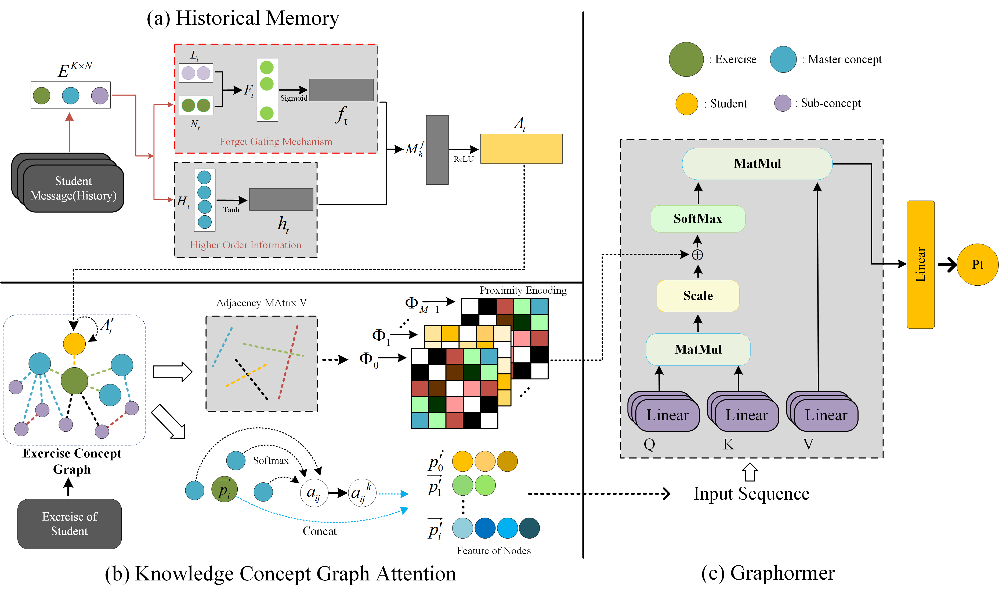

# GTMKT
GAT-Transformer Memory Networks for Forgetting Knowledge Tracing

## Overall Architecture


## Dataset

## Setup

To run this code you need the following:

    a machine with GPUs
    python3
    numpy, pandas, scipy, scikit-learn and torch packages:
```
pip3 install torch==1.7.0 numpy==1.21.2 pandas==1.4.1 scipy==1.7.3 scikit-learn==1.0.2 tqdm==4.26.3 
```
